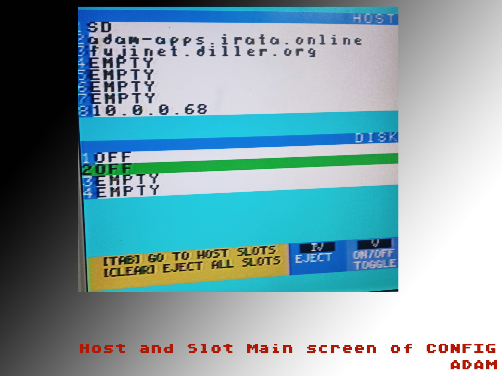

# fujinet-config-adam

More documentation to be written as it takes shape.

This repo is named fujinet-config-adam but it is really the primary repo for the CONFIG application for every supported platform on FujiNet. 

In the beginning there was only Atari. And so the CONFIG application was just called fujinet-config. Then came the ADAM and now common strands for the platforms began to take shape in this repo. Apple II soon joined and benefited from the comonality here. Atari was still on it's own but it is currently in the middle of being brought back into this repo (summer of 2022) so there is again just one place for all CONFIGs going forward.

## What is CONFIG?
CONFIG is the primary management application for the FujiNet device. It manages the WIFI connections and credentials, the SD card if one is inserted into your FN, and it traverses the HOSTS for images to mount in the Virtual SLOTS. The main page of CONFIG is the familiar HOSTS and SLOTS view that greets most people at boot with a FN device active on their system. CONFIG also can copy images to and from the SD card and finally has a configuration screen that shows the current network configuration of the ESP32 on your local network.

The CONFIG application must be coded and compiled to build a native binary application for each host platform. Then there are some scripts used to copy the CONFIG application to a bootable disk image for each platform. The process for those steps varies by platform. The final bootable disk image is then used in the main fujinet repo to flash the fs on the FN with the disk image, which is then loaded and mounted when you are booting the system without a virtual mounted disk.

## Screen Shots

CONFIG on the ADAM

CONFIG on the AppleII

[[./docs/images/fn_apple_config_v1.jpg]]

CONFIG on the Atari

[[docs/images/fn_atari_config_v1.jpg]]

To compile, currently requires:

* make
* Z88DK (http://github.com/z88dk/z88dk)
* eoslib (http://github.com/tschak909/eoslib)
* smartkeyslib (http://github.com/tschak909/smartkeyslib)

Make using 'make -f <file>'
  where file is Makefile.<platform>
