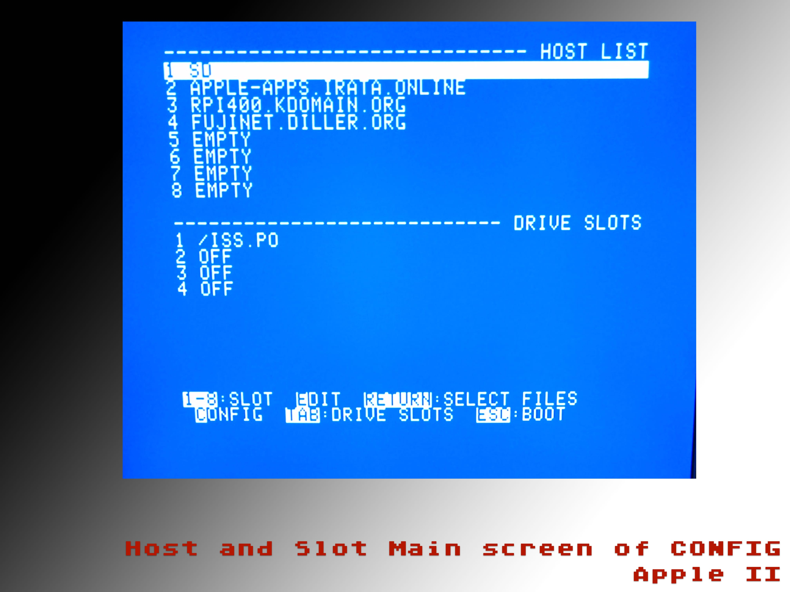
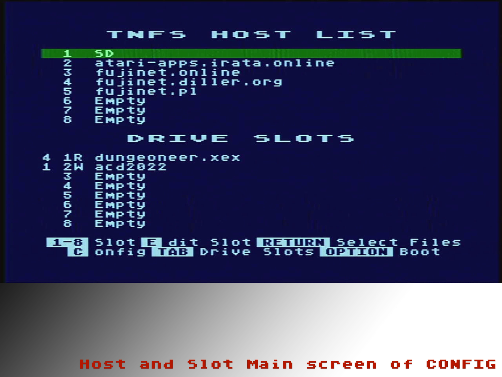

# fujinet-config-adam

More documentation to be written as it takes shape.


This repo is named fujinet-config-adam but it is really the primary repo for the CONFIG application for every supported platform on FujiNet. 

In the beginning there was only Atari. And so the CONFIG application was just called fujinet-config. Then came the ADAM and now common code for all the platforms began to take shape in this repo. Apple II soon joined, then RC2014 and soon C64. Atari was merged back in here in 2022 Fall by frachel so there is one place for all platform CONFIGs going forward.

## What is CONFIG?
CONFIG is the primary management application for the FujiNet device. It manages the WIFI connections and credentials, the SD card if one is inserted , and it traverses the HOSTS for images to mount in the Virtual SLOTS. The main page of CONFIG is the familiar HOSTS and SLOTS view that greets most people at boot with a FN device active on their system. CONFIG also can copy images to and from the SD card (Atari) and it has it's own configuration screen that shows the current network configuration of the ESP32 on your local network.

The CONFIG application must be coded and compiled to build a native binary application for each host platform. Then there are some scripts used to copy the CONFIG application to a bootable disk image for each platform. The process for those steps varies by platform. The final bootable disk image is then used in the main fujinet repo to flash the fs on the FN with the disk image, which is then loaded and mounted when you are booting the system without a virtual mounted disk.


## Compiling on the Atari
To compile, currently requires:
### CC65 built and installed on your system

#### Pull down cc65 code
   * https://github.com/cc65/cc65

#### Build cc65:
``` 
$ PREFIX=/usr/local/cc65 make
$ sudo PREFIX=/usr/local/cc65 make install
```

It also requires these additional tools:

* dir2atr - https://www.horus.com/~hias/atari/atarisio/atarisio-221009.tar.gz
  * download, build and install on your local build system

* https://github.com/FujiNetWIFI/fujinet-config-tools
  * clone that repo and then do a `make dist` in order to get the ftools built for atari
  * these are copied over to the FujiNet Atari Boot Disk to have available from DOS if needed


Now with those prerequisites out of the way:

`$ make -f Makefile.atari clean dist`

Check for any errors. If sucessful there will be an 

```
created image "autorun.atr"
```

copy autorun.atr to ~//fujinet-platformio/data/BUILD_ATARI/ and then using PIO (Platform IO) build  
"Build Filesystem Image" 
Then use "Upload Filesystem Image" to load the new image onto the FujiNet. Your new CONFIG should be ready to use.

## Compiling on the Apple II
To compile, currently requires:

### CC65 built and installed on your system

#### Pull down cc65 code
   * https://github.com/cc65/cc65

#### Build cc65:
``` 
$ PREFIX=/usr/local/cc65 make
$ sudo PREFIX=/usr/local/cc65 make install
```

### Pull PlatformIO repo & config repo
```
git clone https://github.com/FujiNetWIFI/fujinet-platformio.git
git clone https://github.com/FujiNetWIFI/fujinet-config-adam.git
```

* You need the platformIO repo because the build script expects it to be in the same directory as CONFIG, so that it can push the completed Apple boot disk into the proper folder to be pushed to the FN device.

Now with those prerequisites out of the way:

`$ make -f Makefile.apple2 clean dist`

Check for any errors. If sucessful there will be an 

```
java -jar dist.apple2/ac.jar -as dist.apple2/dist.po config.system sys <config
cp dist.apple2/dist.po ../fujinet-platformio/data/BUILD_APPLE/autorun.po
```

you will find your autorun.po in the directory indicated above. You can now flash this to the FN using the PIO's Upload Filesytem Image.


## Compiling on the ADAM
To compile, currently requires:

* make
* Z88DK (http://github.com/z88dk/z88dk)
* eoslib (http://github.com/tschak909/eoslib)
* smartkeyslib (http://github.com/tschak909/smartkeyslib)

Make using 'make -f <file>'
  where file is Makefile.<platform>


## Screen Shots

### CONFIG on the ADAM


### CONFIG on the AppleII


### CONFIG on the Atari



